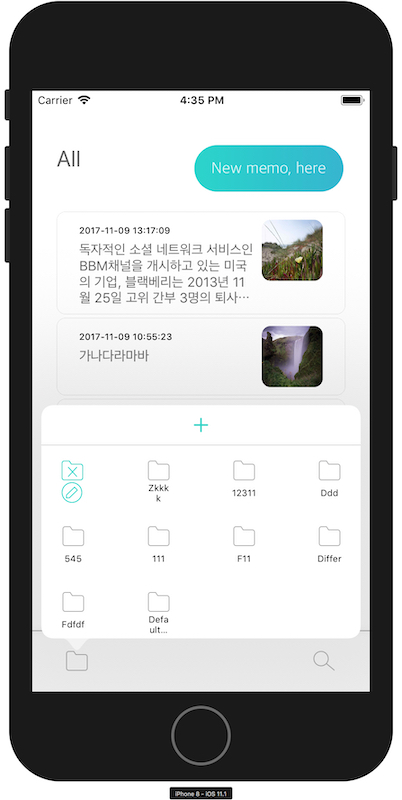
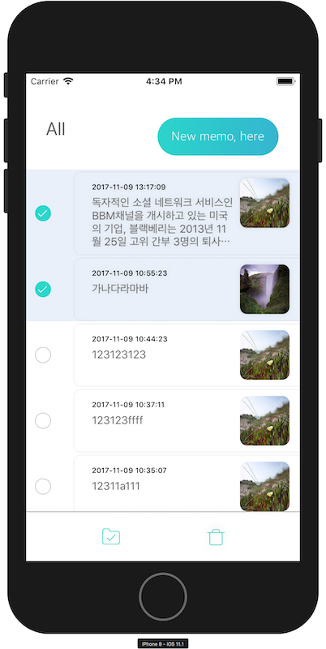

# 팀 프로젝트 PEMO

스터디 팀 프로젝트 PEMO 
간편하고, 폴더링이 가능한 메모앱을 만들고자 디자이너, iOS개발자, AOS개발자, 백앤드 개발자가 모여 시작한 프로젝트.

# 컨셉

메모를 쉽게 만들고, 폴더를 쉽게 만들고, 사용하기 편한 메모장

# 사용한 Open Source

 - Alamofire : https://github.com/Alamofire/Alamofire
 - SwiftyJSON : https://github.com/SwiftyJSON/SwiftyJSON
 - Toaster : https://github.com/devxoul/Toaster
 - RealmSwift : https://github.com/realm/realm-cocoa
 - KingFisher : https://github.com/onevcat/Kingfisher
 - KUIPopOver : https://github.com/Kofktu/KUIPopOver
 # 이미지

